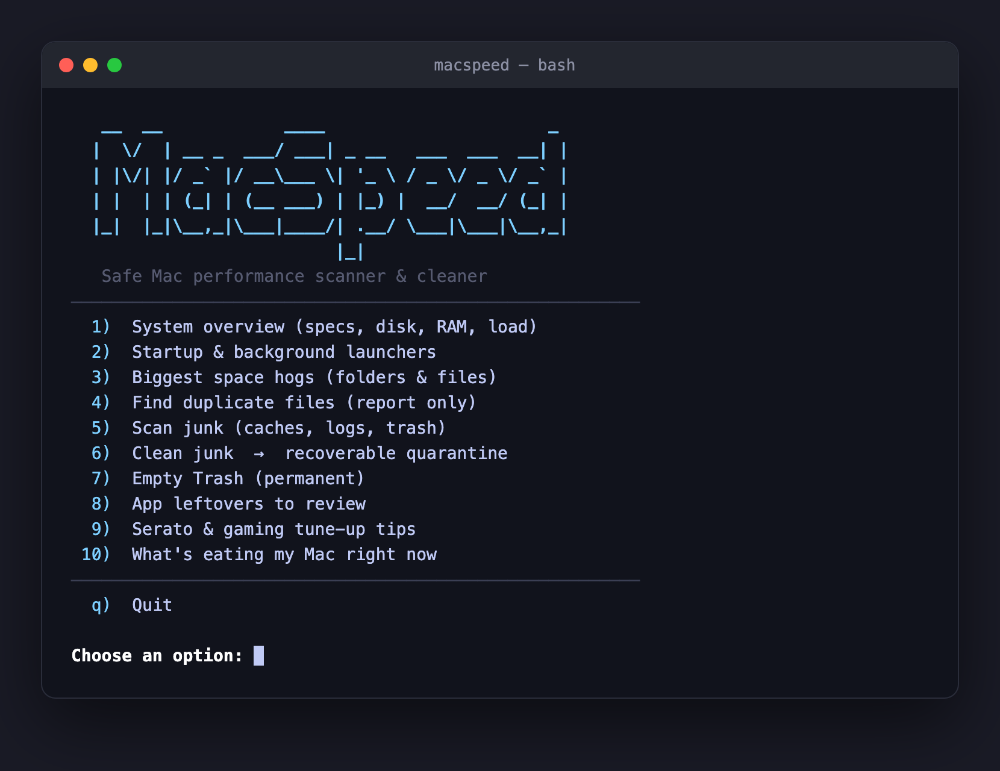

# MacSpeed

A safe, friendly performance scanner & cleaner for macOS — built for older
Intel MacBooks (think 2-core / 8GB), but works on any Mac. No dependencies,
no install, no telemetry. Just a single Bash script that explains everything
it's about to do and never deletes anything without asking.



## Why

Most "cleaner" apps are heavy, nag you, or aggressively delete things you can't
get back. MacSpeed does the opposite: it **scans and reports by default**, and
when you do clean, it **moves junk to a recoverable folder** instead of erasing
it. You stay in control.

## Install & run

```bash
git clone https://github.com/SubchiBeats/macspeed.git
cd macspeed
bash macspeed.sh
```

Or, for a double-click experience: open the `macspeed` folder in Finder and
double-click **`MacSpeed.command`**. (First time only, macOS may block an
unsigned script — right-click the file → **Open** → **Open**, and it'll
remember after that.)

## What it does

| # | Option | Touches your files? |
|---|--------|---------------------|
| 1 | System overview — specs, disk, RAM, load, swap | No |
| 2 | Startup & background launchers (login items, LaunchAgents/Daemons) | No (tells you where to disable) |
| 3 | Biggest space hogs (folders & files) | No (report + opens Finder) |
| 4 | Duplicate file finder (by size + checksum) | No (report only) |
| 5 | Junk scan (cache / log / trash sizes) | No |
| 6 | Clean junk | Moves to a **recoverable quarantine folder** |
| 7 | Empty Trash | **Permanent** — asks you to type `yes` |
| 8 | App leftovers to review | No (report + opens Finder) |
| 9 | Serato & gaming tune-up tips | No |
| 10 | What's eating my Mac right now | No |

## Safety guarantees

- **Nothing is deleted without you typing `yes`.**
- **Cleanup is reversible.** Option 6 *moves* junk (caches, logs, saved app
  state) into `~/MacSpeed-Quarantine-<date>`. Drag anything back out if you
  miss it. Disk space is reclaimed only when *you* delete that folder.
- It only ever touches well-known **regenerated junk** — never your documents,
  photos, music, downloads, app settings, or system files.
- Duplicate and large-file tools **only report** and open Finder. You decide.

> Why a home folder and not the Trash? macOS protects `~/.Trash` from Terminal
> (TCC), so a plain `mv` into your home directory is the method that reliably
> works without granting Full Disk Access.

## Good habits on an 8GB Mac

1. **Restart every few days** — limited RAM benefits most from this.
2. **Quit apps you aren't using** — browsers with many tabs and Electron apps
   are the usual hogs (see option 10).
3. **Trim login items** (option 2).
4. Re-run MacSpeed monthly: option 5 to scan, option 6 to clean.

## License

[MIT](LICENSE) — do whatever you like with it.
